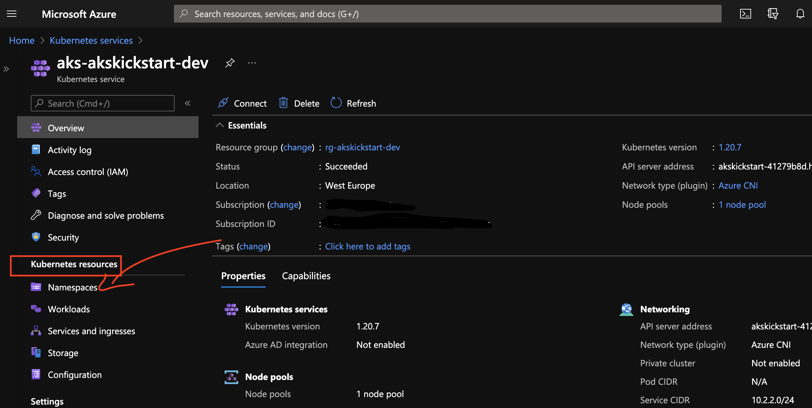

# Lab 2.  Explore kubernetes api using the various tools.

#### In this lab we will explore the kubernetes api using the proxy, kubectl, VS Code, the azure portal and C#

## 1. Explore the apiserver using the proxy
Run the following command to start the proxy. The proxy will handle exposing of and authentication to the kubernetes apiserver.

```powershell
kubectl proxy --port 8080
```

Open another powershell terminal to start exploring the api, and run the following command to set the api url.

```powershell
$api = "http://localhost:8080"
```

We can now start exploring the kubeserver api, run the following command to query the api versions:

```powershell
Invoke-RestMethod -Uri $api/api | ConvertTo-Json
```
<!-- markdownlint-disable MD033 -->
<p>
<details>
  <summary>&#x261d; &#xfe0f; Hint </summary>
<ul>  
  <p>You can colorize the output by using <a href="https://stedolan.github.io/jq/download">jq</a>, you can then view the colorized output by </p>

```powershell
  Invoke-RestMethod -Uri $api/api | ConvertTo-Json | jq -C
```
</ul>
</details>
</p>
<!-- markdownlint-enable MD033 -->

Run the following command to query the nodes in the cluster:

```powershell
Invoke-RestMethod -Uri $api/api/v1/nodes | ConvertTo-Json
```

Run the following command to query the namespaces in the cluster:

```powershell
Invoke-RestMethod -Uri $api/api/v1/namespaces | ConvertTo-Json
```

Run the following command to query the pods in the kube-system namespace:

```powershell
Invoke-RestMethod -Uri $api/api/v1/namespaces/kube-system/pods | ConvertTo-Json
```

We can also create items using the api, to create a namespace add the file [file](../../exercises/lab2/namespace.json) to you current directory `exercises/lab2/namespace.json`. You can then create the namespace by running the following command:

```powershell
Invoke-RestMethod -Uri $api/api/v1/namespaces -Method POST  -ContentType application/json -InFile ./exercises/lab2/namespace.json   | ConvertTo-Json
```

We can also retreive the created namespace by running the follwing command:

```powershell
Invoke-RestMethod -Uri $api/api/v1/namespaces/dev | ConvertTo-Json
```

We can also edit the namespace using the proxy, edit the json and add an extra label `author` with your name as the value, and run the following command:

```powershell
Invoke-RestMethod -Uri $api/api/v1/namespaces/dev -Method PUT  -ContentType application/json -InFile ./exercises/lab2/namespace.json   | ConvertTo-Json
```

Finally let's delete the namespace by running the following command:

```powershell
Invoke-RestMethod -Uri $api/api/v1/namespaces/dev -Method DELETE | ConvertTo-Json
```

## 2. Explore the apiserver using kubeclt cli

We can also use the kubernetes command-line tool `kubectl` to query the kubernetes api.

We can view all the pods in the `common-keda` namespace by running the follwing command, the ` -n ` flag sets the namespace to for running the query, it can also be replaced with the flag ` --namespace `:

```powershell
kubectl get po -n common-keda
```

We can also get the namespaces by running the following command:

```powershell
kubectl get namespaces
```

<!-- markdownlint-disable MD033 -->
<p>
<details>
  <summary>&#x261d; &#xfe0f; Hint </summary>
<ul>
<h3>kubeclt Output:</h3>  
  <p>The output will be in human readable plain-text format but you can change the format to json by running the following command:</p>

```powershell
kubectl get namespaces -o json
```

  <p>You can find more output formats <a href="https://kubernetes.io/docs/reference/kubectl/overview/#output-options">here</a>.</p>

 <h3>Shortnames:</h3>  
  <p>You van also shorten the command by using the namespaces shorname ns :</p>

```powershell
kubectl get ns -o json
```

  <p>kubectl has alot of these shortnames, you can run the following command to find more of them:</p>

```powershell
kubectl api-resources
```  
</ul>  
</details>
</p>
<!-- markdownlint-enable MD033 -->

We can also create a namespace by running the following command:

```powershell
kubectl create -f ./exercises/lab2/namespace.json
```  

You can then view the created namespace by running:

```powershell
kubectl get ns dev
```

Editing the namespace can be done by running the following command:

```powershell
kubectl edit ns dev
```

This should open the default `KUBE_EDITOR` with the current namespace yaml definition, you can then edit this file in place and save it to update the namespace.

The namespace can be deleted by running the following command:

```powershell
kubectl delete ns dev
```

Instead of using the create and edit commands you can also use the apply command, this will allow you to manage and version your resource definitions in source control.

```powershell
kubectl apply -f ./exercises/lab2/namespace.json
```

If you run the command again you should see the following output:

```text
namespace/dev unchanged
```

When you edit the file to add or remove the author label and apply it again you should get the following output:

```text
namespace/dev configured
```

Run the following command to delete the namespace:

```powershell
kubectl delete ns dev
```

You can find out more about managing resources with kubectl [here](https://kubernetes.io/docs/concepts/cluster-administration/manage-deployment/).

## 3. Explore the apiserver using azure portal
Navigate to the [azure portal](https://portal.azure.com) and find your newly created Kubernetes Service.

Then navigate to the namespaces tab uncer `Kubernetes resources`, and create, update and delete the dev namespace again.


While you are in the portal take the time to explore the other tabs beneath the kubernetes resources section. We will be discussing almost all of these resources in this workshop.

## 4. Explore the apiserver using vs code

We can also use [this](https://marketplace.visualstudio.com/items?itemName=ms-kubernetes-tools.vscode-kubernetes-tools) vs code extension to explore the kubernetes resources. One you have installed the extension you can the navigate to kubernetes tab and explore the resources there.


You can read more about vs code and kubernetes [here](https://code.visualstudio.com/docs/azure/kubernetes).

## 5. Explore the apiserver using C# and .Net Core
Kubernetes also has [client libraries](https://kubernetes.io/docs/reference/using-api/client-libraries/) that allow you to manages your cluster from code. In this exercise we will use the [.Net library](https://github.com/kubernetes-client/csharp) to explore the api.

Create a new C# console application and add the `KubernetesClient` nuget package.


```powershell
dotnet new console -o ExploreKubernetesApi    
cd ExploreKubernetesApi
dotnet add package KubernetesClient
```

Open the `Program.cs` file and replace the code with following:

```C#
using System;
using System.Collections.Generic;
using System.Threading;
using System.Threading.Tasks;
using k8s;
using k8s.Models;

namespace ExploreKubernetesApi
{
    class Program
    {
        static async Task Main(string[] args)
        {
            var config = KubernetesClientConfiguration.BuildConfigFromConfigFile();
            var client = new Kubernetes(config);
            await ListNamespaces(client);
            await CreateNamespace(client, "dev");
            await GetNamespace(client, "dev");
            await UpdateNamespace(client, "dev", new Dictionary<string, string>
            {
                {"author" ,"wema"}
            });
            await GetNamespace(client, "dev");
            await DeleteNamespace(client, "dev");
            Console.ReadLine();
        }

        private static async Task ListNamespaces(Kubernetes client)
        {
            Console.WriteLine("Found the following namespaces:");
            Console.WriteLine("===============================");
            var namespaces = await client.ListNamespaceWithHttpMessagesAsync();
            foreach (var ns in namespaces.Body.Items) {
                Console.WriteLine(ns.Metadata.Name);
            }
            Console.WriteLine("===============================");
        }

        private static async Task GetNamespace(Kubernetes client, string name)
        {
            var result = await client.ReadNamespaceWithHttpMessagesAsync(name, "true" );
            if (result.Response.IsSuccessStatusCode)
            {

                WriteInfo(await result.Response.Content.ReadAsStringAsync(), ConsoleColor.Yellow);
            }
        }

        private static async Task CreateNamespace(Kubernetes client, string name, Dictionary<string, string> labels = null)
        {
            //Create neamespace
            var ns = new V1Namespace
            {
                Metadata = new V1ObjectMeta
                {
                    Name = name,
                    Labels = labels
                }
            };

            var result = await client.CreateNamespaceWithHttpMessagesAsync(ns, pretty:"true");
            Console.WriteLine($"Created namespace: {result.Body.Metadata.Name}");
            WriteInfo(await result.Response.Content.ReadAsStringAsync());
        }
        private static async Task UpdateNamespace(Kubernetes client, string name, Dictionary<string, string> labels = null)
        {
            //Create neamespace
            var ns = new V1Namespace
            {
                Metadata = new V1ObjectMeta
                {
                    Name = name,
                    Labels = labels
                }
            };

            var result = await client.PatchNamespaceWithHttpMessagesAsync(new V1Patch(ns, V1Patch.PatchType.MergePatch), name, pretty:"true");
            Console.WriteLine($"Updated Namespace: {result.Body.Metadata.Name}");
            WriteInfo(await result.Response.Content.ReadAsStringAsync());
        }
        
        private static async Task DeleteNamespace(Kubernetes client, string name)
        {
            var status = await client.DeleteNamespaceWithHttpMessagesAsync(name, new V1DeleteOptions());
            if (status.Response.IsSuccessStatusCode)
            {
                Console.WriteLine($"Deleted namespace {name}");
            }

            
        }

        private static void WriteInfo(string info, ConsoleColor color = ConsoleColor.Green)
        {
            Console.ForegroundColor = color;
            Console.WriteLine(info);    
            Console.ResetColor();
        }
    }
}
```

Examine and run the code to see the generated output.

## 6: Watching kubernetes resources

Apart from being able to run the usual CRUD operations, we can also ask the kubernetes client to notify us when a resource or list of resources has changed. If you run the following command:

```powershell
kubectl get namespaces -w
```

You will notice that the command has not finished executing, this is because it is now watching for any namespace changes that might occur. If you run the above C# project again you will see the output changing. The output should look something like this:

```text
NAME                      STATUS   AGE
common-azure-ingress      Active   3d9h
common-keda               Active   3d9h
common-managed-identity   Active   3d9h
default                   Active   3d9h
kube-node-lease           Active   3d9h
kube-public               Active   3d9h
kube-system               Active   3d9h
dev                       Active   0s
dev                       Active   0s
dev                       Terminating   0s
dev                       Terminating   6s
dev                       Terminating   6s
```

We can also watch for changes using the .net client, let's add the following method to our project:

```C#
private static async Task WatchNamespaces(Kubernetes client)
        {
            Console.WriteLine("Found the following namespaces:");
            Console.WriteLine("===============================");
            var namespaces = await client.ListNamespaceWithHttpMessagesAsync(watch:true);
            using (namespaces.Watch<V1Namespace, V1NamespaceList>((type, item) =>
            {
                Console.WriteLine("==on watch event==");
                Console.WriteLine(type);
                Console.WriteLine(item.Metadata.Name);
                Console.WriteLine("==on watch event==");
            }))
            {
                Console.WriteLine("press ctrl + c to stop watching");

                var ctrlc = new ManualResetEventSlim(false);
                Console.CancelKeyPress += (sender, eventArgs) => ctrlc.Set();
                ctrlc.Wait();
            }
        }
```

Edit the main function so it is calling the `WatchNamespaces` method, and run the project. You can now use any of the above methods to create, edit or delete namespaces and you should see the output from the console app change accordingly.  

## :exclamation: Kubernetes api Security

In [lab1](./lab1-environment-setup/LAB.md) when you ran the `az aks get-credentials` command you added information locally about how to access the cluster. This information is being used when accessing the cluster locally. You can view this information by running the following command:

```powershell
kubectl config view
```

The output should look something like this:

```text
apiVersion: v1
clusters:
- cluster:
    certificate-authority-data: DATA+OMITTED
    server: https://akskickstart-41279b8d.hcp.westeurope.azmk8s.io:443
  name: aks-akskickstart-dev
contexts:
- context:
    cluster: aks-akskickstart-dev
    user: clusterUser_rg-akskickstart-dev_aks-akskickstart-dev
  name: aks-akskickstart-dev
current-context: aks-akskickstart-dev
kind: Config
preferences: {}
users:
- name: clusterUser_rg-akskickstart-dev_aks-akskickstart-dev
  user:
    client-certificate-data: REDACTED
    client-key-data: REDACTED
    token: REDACTED
```

This config file contains all the information necessary to access the cluster and perform most operations. When using the .net client we are authenticating using this file, you can see that on line 13 of the `Program.cs` file.

```C#
var config = KubernetesClientConfiguration.BuildConfigFromConfigFile();
```

<!-- markdownlint-disable MD033 -->
<details>
  <summary style="font-size:24px; font-weight:bold;">&#10067;Quiz</summary></h3>

<ul>

```powershell
kubectl get namespaces -o json
```

</ul>
</details>

<!-- markdownlint-enable MD033 -->

<!-- markdownlint-disable MD033 -->
<details>
  <summary style="font-size:24px; font-weight:bold;">&#127873; Bonus</summary>

<ul>
Run the following commands to download and view the kubernetes api details using OpenApi. Note: if you are running Docker for Windows make sure you are using Linux containers.

```powershell
kubectl proxy --port 8080
mkdir openapi
Invoke-RestMethod -Uri http://localhost:8080//openapi/v2 -OutFile openapi/k8s.json  
docker pull swaggerapi/swagger-ui
docker run --rm -p 8081:8080 -e SWAGGER_JSON=/foo/k8s.json -v $pwd/openapi:/foo swaggerapi/swagger-ui
```

You should now be able to view to kubernetes api details by navigating to [http://localhost:8081](http://localhost:8081)

You can also use the OpenApi details to import a collection into [Postman](https://learning.postman.com/docs/integrations/available-integrations/working-with-openAPI/), or any other OpenApi client.
</ul>
</details>
<!-- markdownlint-enable MD033 -->

[:arrow_backward: previous](../lab1-environment-setup/LAB.md)  [next :arrow_forward:](../lab3-workloads/LAB.md)
