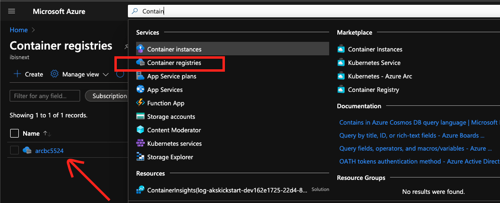
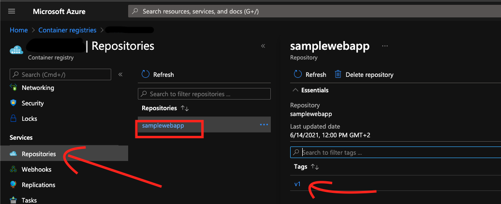
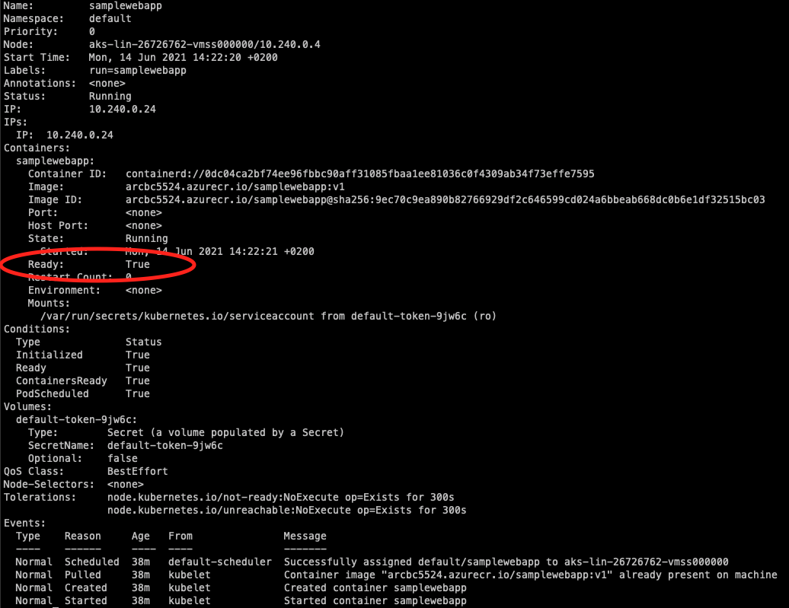

# Lab 3. Running your applications in kubernetes

### In this lab we will look at the various ways we can run workloads in kubernetes

## 1. Creating and running a pod in kubernetes

Let's start by creating a namespace for all the work we will be doing this lab, and setting it as the default namespace.

```powershell
kubectl create namespace lab3 
kubectl config set-context --current --namespace=lab3
```

Now let's create a new .NET 5 web application, you can follow along with the steps here or you can use visual studio and add docker support.

```powershell
mkdir lab3
cd lab3
dotnet new web -o SimpleWebApp
```

Optionally change the `Startup.cs` file and edit the following line to something fun or original.

```C#
endpoints.MapGet("/", async context =>
{
    await context.Response.WriteAsync("Hello World!");
});
```

Run the application to make sure it is working as expected.

```powershell
cd SimpleWebApp
dotnet run
```

Add a new Dockerfile to the `lab3` directory and copy the following text into that file.

```Dockerfile
#See https://aka.ms/containerfastmode to understand how Visual Studio uses this Dockerfile to build your images for faster debugging.

FROM mcr.microsoft.com/dotnet/aspnet:5.0 AS base
WORKDIR /app
EXPOSE 80
EXPOSE 443

FROM mcr.microsoft.com/dotnet/sdk:5.0 AS build
WORKDIR /src
COPY ["SimpleWebApp/SimpleWebApp.csproj", "SimpleWebApp/"]
RUN dotnet restore "SimpleWebApp/SimpleWebApp.csproj"
COPY . .
WORKDIR "/src/SimpleWebApp"
RUN dotnet build "SimpleWebApp.csproj" -c Release -o /app/build

FROM build AS publish
RUN dotnet publish "SimpleWebApp.csproj" -c Release -o /app/publish

FROM base AS final
WORKDIR /app
COPY --from=publish /app/publish .
ENTRYPOINT ["dotnet", "SimpleWebApp.dll"]
```

When we set up our environment in [lab1](../lab1-environment-setup/LAB.md) we also created a [Azure Container Registry](https://docs.microsoft.com/en-us/azure/container-registry/), we can use this registry to build and host our SimpleWebApp application. Assuming you only have one Container registry in your subscription you can get the name by running the following command.

```powershell
$ACR_NAME=az acr list --query '[].name' -otsv
```

We can the build the application by running the following command from the `lab3` directory

```powershell
az acr build --registry $ACR_NAME --image samplewebapp:v1 .
```

You should be able to find the image you just build if navigate to azure and search for `Container`, and select `Container registries`



One you have navigated to your Container registry, you will find your image under `Repositories > samplewebapp`



Before we deploy the container to our cluster let's first test it locally

```powershell
# login into to the azure container registry
az acr login -n $ACR_NAME
# run the application locally
docker run --rm -it -p 8082:80 "$($ACR_NAME).azurecr.io/samplewebapp:v1" 
```

Navigate to [http://localhost:8082](http://localhost:8082) and check that the output is the same as before.

We can now run and inspect this application in the cluster by running the following commands.

```powershell
kubectl run  --image "$($ACR_NAME).azurecr.io/samplewebapp:v1" samplewebapp
kubectl describe pod/samplewebapp
```

<!-- markdownlint-disable MD033 -->
<p>
<details>
  <summary>&#x261d; &#xfe0f; Hint </summary>
<ul>  
  <p>The describe command provides detailed information about the resource and any recent events that are associated with the resource. You can read more about this <a href="https://kubernetes.io/docs/tasks/debug-application-cluster/debug-application-introspection/#using-kubectl-describe-pod-to-fetch-details-about-pods">here</a></p>
</ul>
</details>
</p>
<!-- markdownlint-enable MD033 -->

You can keep checking the describe command untill the pod state is `Running`


We could examine the pod by using the command below and navigating to [http://localhost:8083](http://localhost:8083)

```powershell
kubectl port-forward samplewebapp 8083:80
```

But instead we will expose the pod using a kubernetes service object. We will be diving into services in greater detail in Lab 5.

Let's run the commands below to expose the pod using a public IP address.

```powershell
kubectl expose po/samplewebapp --port 80 --type LoadBalancer
kubectl get service samplewebapp -w
```

The output of this command will looks like this:

```text
NAME           TYPE           CLUSTER-IP   EXTERNAL-IP   PORT(S)        AGE
samplewebapp   LoadBalancer   10.2.2.20    <pending>     80:31740/TCP   11s
```

After a while the `EXTERNAL-IP` state will change form `<pending>` to an IP address:

```text
NAME           TYPE           CLUSTER-IP   EXTERNAL-IP   PORT(S)        AGE
samplewebapp   LoadBalancer   10.2.2.20    <pending>     80:31740/TCP   11s
samplewebapp   LoadBalancer   10.2.2.20    20.93.176.14   80:31740/TCP   17s
```

We can now navigate to this IP address and see our now familiar web page.

## 2. Scaling out with ReplicaSets

Let's simulate an application error that crashes the pod by deleting it.

```powershell
kubectl delete po samplewebapp 
```

Our web application is now down and if we try to refresh the page we will get an error.

This is where `ReplicaSets` can help, they give us two great benefits:

1. We can have multiple instances (replicas) of the same pods running.

2. Reconciliation loops, kubernetes will be continuously checking the desired state (number of replicas) vs the observed/current state, and will take action to ensure the observed state matches the desired state. You can read more about this [here](https://kubernetes.io/docs/concepts/architecture/controller/).

First let's delete the service, we will create another one soon.

```powershell
kubectl delete service/samplewebapp
```

Next create a file `samplewebapp.rs.yaml` and copy the content below into the file. Make sure to replace `<your-acr-name>` with the `$ACR_NAME` value.

```yaml
apiVersion: apps/v1
kind: ReplicaSet
metadata:
  labels:
    app: samplewebapp
  name: samplewebapp
spec:
  replicas: 2
  selector:
    matchLabels:
      app: samplewebapp
  template:
    metadata:
      labels:
        app: samplewebapp
    spec:
      containers:
      - image: <your-acr-name>.azurecr.io/samplewebapp:v1
        name: samplewebapp
```

Now let's create the `ReplicaSet` and inspect the created resources

```powershell
kubectl apply -f ./samplewebapp.rs.yaml
kubectl get all
kubectl describe replicasets/samplewebapp
```

<!-- markdownlint-disable MD033 -->
<p>
<details>
  <summary>&#x2757; Note </summary>
<ul>  
  <p> So far we have been using imperative commands to manage objects, in the above example we are using declarative object configuration to manage the kubernetes objects. You can read more about this <a href="https://kubernetes.io/docs/concepts/overview/working-with-objects/object-management/">here</a>.</p>
</ul>
</details>
</p>
<!-- markdownlint-enable MD033 -->


Let's expose the pods again but this time by exposing the `ReplicaSet`

```powershell
kubectl expose replicaset/samplewebapp --port 80 --type LoadBalancer
kubectl get service samplewebapp -w
```

One we have an IP address we should be able navigate to our web application. We can the delete one of the pods but the web application will remain available. Not only is our application still available, but another pod will be scheduled to take the old pods place ensuring that we have the desired amount of pods running.

We can even delete all pods and our application will only be briefly unavailable.

```powershell
kubectl delete po --all
```

We can also scale the `ReplicaSet` up or down using the command below, obviously if you scale to `0` your web application won't be available.

```powershell
kubectl scale replicaset samplewebapp --replicas 5 
```

## 3. Managing your application with Deployments

It is unusual to create `ReplicaSets` and you should normally use the higher-level `Deployment` object. You can read more about this [here](https://kubernetes.io/docs/concepts/workloads/controllers/replicaset/#when-to-use-a-replicaset).

The `Deployments` expose the same api as `ReplicaSets` with a few additional features, in fact we can run the entire example in the previous chapter replacing all occurances of replicasets with deployments. You can read more about the use cases for deployments [here](https://kubernetes.io/docs/concepts/workloads/controllers/deployment/#use-case).

First let us delete the resources we just created.

```powershell
kubectl delete replicaset.apps/samplewebapp  service/samplewebapp
```

Now let's edit our web application, rebuild and run it using a new tag `v2`

```powershell
az acr build --registry $ACR_NAME --image samplewebapp:v2 .
docker run --rm -it -p 8082:80 "$($ACR_NAME).azurecr.io/samplewebapp:v2"
```

Navigate to http://localhost:8082 and check that the output is as espected.

Next let's rename or copy `samplewebapp.rs.yaml` file to `samplewebapp.deployment.yaml` and change the Kind property from `ReplicaSet` to `Deployment`. 

We can create the deployment resources and expose the pods.

```powershell
kubectl apply -f ./samplewebapp.deployment.yaml --record
kubectl expose deployment/samplewebapp --port 80 --type LoadBalancer
kubectl get service samplewebapp -w
```

Our web application should now be available on the service external IP address.

Now let's open a seperate terminal and run the following command to start watching any deployments we might have.

```powershell
kubectl get deployments -w -owide
```
Open another terminal and let's start watching the replicasets

```powershell
kubectl get replicasets -w -owide
```

Open a 3rd terminal and let's watch the pods

```powershell
kubectl get pods -w -owide
```

Let's now edit the file `samplewebapp.deployment.yaml` and change the image tag to `v2` and let's apply this file again.

```powershell
kubectl apply -f ./samplewebapp.deployment.yaml --record
```

If we refresh de web application we should see that the output has changed to our new web application.

We can also inspect the output of our various watchers to see exactly what happened.

Deployments:

```text
NAME           READY   UP-TO-DATE   AVAILABLE   AGE   CONTAINERS     IMAGES                                 SELECTOR
samplewebapp   2/2     2            2           10m   samplewebapp   arcbc5524.azurecr.io/samplewebapp:v1   app=samplewebapp
samplewebapp   2/2     2            2           11m   samplewebapp   arcbc5524.azurecr.io/samplewebapp:v2   app=samplewebapp
samplewebapp   2/2     2            2           11m   samplewebapp   arcbc5524.azurecr.io/samplewebapp:v2   app=samplewebapp
samplewebapp   2/2     0            2           11m   samplewebapp   arcbc5524.azurecr.io/samplewebapp:v2   app=samplewebapp
samplewebapp   2/2     1            2           11m   samplewebapp   arcbc5524.azurecr.io/samplewebapp:v2   app=samplewebapp
samplewebapp   3/2     1            3           11m   samplewebapp   arcbc5524.azurecr.io/samplewebapp:v2   app=samplewebapp
samplewebapp   2/2     1            2           11m   samplewebapp   arcbc5524.azurecr.io/samplewebapp:v2   app=samplewebapp
samplewebapp   2/2     2            2           11m   samplewebapp   arcbc5524.azurecr.io/samplewebapp:v2   app=samplewebapp
samplewebapp   3/2     2            3           11m   samplewebapp   arcbc5524.azurecr.io/samplewebapp:v2   app=samplewebapp
samplewebapp   2/2     2            2           11m   samplewebapp   arcbc5524.azurecr.io/samplewebapp:v2   app=samplewebapp
```

ReplicaSets:

```text
NAME                      DESIRED   CURRENT   READY   AGE   CONTAINERS     IMAGES                                 SELECTOR
samplewebapp-7595b5cb8b   2         2         2       10m   samplewebapp   arcbc5524.azurecr.io/samplewebapp:v1   app=samplewebapp,pod-template-hash=7595b5cb8b
samplewebapp-7df95b4555   1         0         0       0s    samplewebapp   arcbc5524.azurecr.io/samplewebapp:v2   app=samplewebapp,pod-template-hash=7df95b4555
samplewebapp-7df95b4555   1         0         0       0s    samplewebapp   arcbc5524.azurecr.io/samplewebapp:v2   app=samplewebapp,pod-template-hash=7df95b4555
samplewebapp-7df95b4555   1         1         0       0s    samplewebapp   arcbc5524.azurecr.io/samplewebapp:v2   app=samplewebapp,pod-template-hash=7df95b4555
samplewebapp-7df95b4555   1         1         1       3s    samplewebapp   arcbc5524.azurecr.io/samplewebapp:v2   app=samplewebapp,pod-template-hash=7df95b4555
samplewebapp-7595b5cb8b   1         2         2       11m   samplewebapp   arcbc5524.azurecr.io/samplewebapp:v1   app=samplewebapp,pod-template-hash=7595b5cb8b
samplewebapp-7df95b4555   2         1         1       3s    samplewebapp   arcbc5524.azurecr.io/samplewebapp:v2   app=samplewebapp,pod-template-hash=7df95b4555
samplewebapp-7595b5cb8b   1         2         2       11m   samplewebapp   arcbc5524.azurecr.io/samplewebapp:v1   app=samplewebapp,pod-template-hash=7595b5cb8b
samplewebapp-7df95b4555   2         1         1       3s    samplewebapp   arcbc5524.azurecr.io/samplewebapp:v2   app=samplewebapp,pod-template-hash=7df95b4555
samplewebapp-7595b5cb8b   1         1         1       11m   samplewebapp   arcbc5524.azurecr.io/samplewebapp:v1   app=samplewebapp,pod-template-hash=7595b5cb8b
```

Pods

```text
NAME                            READY   STATUS    RESTARTS   AGE   IP            NODE                          NOMINATED NODE   READINESS GATES
samplewebapp-7595b5cb8b-hdmpc   1/1     Running   0          10m   10.240.0.18   aks-lin-26726762-vmss000000   <none>           <none>
samplewebapp-7595b5cb8b-w7g5s   1/1     Running   0          10m   10.240.0.30   aks-lin-26726762-vmss000000   <none>           <none>
samplewebapp-7df95b4555-d9tft   0/1     Pending   0          0s    <none>        <none>                        <none>           <none>
samplewebapp-7df95b4555-d9tft   0/1     Pending   0          0s    <none>        aks-lin-26726762-vmss000000   <none>           <none>
samplewebapp-7df95b4555-d9tft   0/1     ContainerCreating   0          0s    <none>        aks-lin-26726762-vmss000000   <none>           <none>
samplewebapp-7df95b4555-d9tft   1/1     Running             0          3s    10.240.0.15   aks-lin-26726762-vmss000000   <none>           <none>
samplewebapp-7595b5cb8b-hdmpc   1/1     Terminating         0          11m   10.240.0.18   aks-lin-26726762-vmss000000   <none>           <none>
samplewebapp-7df95b4555-vfjzm   0/1     Pending             0          0s    <none>        <none>                        <none>           <none>
samplewebapp-7df95b4555-vfjzm   0/1     Pending             0          0s    <none>        aks-lin-26726762-vmss000000   <none>           <none>
samplewebapp-7df95b4555-vfjzm   0/1     ContainerCreating   0          0s    <none>        aks-lin-26726762-vmss000000   <none>           <none>
samplewebapp-7df95b4555-vfjzm   1/1     Running             0          1s    10.240.0.27   aks-lin-26726762-vmss000000   <none>           <none>
samplewebapp-7595b5cb8b-hdmpc   0/1     Terminating         0          11m   10.240.0.18   aks-lin-26726762-vmss000000   <none>           <none>
samplewebapp-7595b5cb8b-w7g5s   1/1     Terminating         0          11m   10.240.0.30   aks-lin-26726762-vmss000000   <none>           <none>
samplewebapp-7595b5cb8b-w7g5s   0/1     Terminating         0          11m   10.240.0.30   aks-lin-26726762-vmss000000   <none>           <none>
samplewebapp-7595b5cb8b-hdmpc   0/1     Terminating         0          11m   10.240.0.18   aks-lin-26726762-vmss000000   <none>           <none>
samplewebapp-7595b5cb8b-hdmpc   0/1     Terminating         0          11m   10.240.0.18   aks-lin-26726762-vmss000000   <none>           <none>
samplewebapp-7595b5cb8b-w7g5s   0/1     Terminating         0          11m   10.240.0.30   aks-lin-26726762-vmss000000   <none>           <none>
samplewebapp-7595b5cb8b-w7g5s   0/1     Terminating         0          11m   10.240.0.30   aks-lin-26726762-vmss000000   <none>           <none>
```

From the logs you can see that the deployment ran by creating a new pod and the deleting one of the old pods, untill there where only new pods left. This is the default deployment strategy `RollingUpdate` you can also configure the deployment to remove all the old pods before creating new ones the `Recreate` strategy. You can read more about this [here](https://kubernetes.io/docs/concepts/workloads/controllers/deployment/#strategy).

Because we are using deployments we can now inspect the history of our deployment using the following command.

```powershell
kubectl rollout history deployment samplewebapp
```

We can also undo our last change and revert back to the initial deployment.

```powershell
kubectl rollout undo deployment samplewebapp --to-revision=1
```

If we refresh de web application we should see that the output has changed back. 

## 4. Other Workloads

So far in this lab we have discussed 3 types of workloads `Pods` and the higher-level workload `ReplicaSet` and `Deployments`. Below is a list of the other workloads. We wont dive into these workloads now but it is good to know about them.

### DaemonSet
From the [docs](https://kubernetes.io/docs/concepts/workloads/controllers/daemonset/):
> A DaemonSet ensures that all (or some) Nodes run a copy of a Pod. As nodes are added to the cluster, Pods are added to them. As nodes are removed from the cluster, those Pods are garbage collected. Deleting a DaemonSet will clean up the Pods it created.
>
> Some typical uses of a DaemonSet are:
> 
> - running a cluster storage daemon on every node
> - running a logs collection daemon on every node
> - running a node monitoring daemon on every node
>
>In a simple case, one DaemonSet, covering all nodes, would be used for each type of daemon. A more complex setup might use multiple DaemonSets for a single type of daemon, but with different flags and/or different memory and cpu requests for different hardware types.

You can list all the running `DaemonSets` in the cluster by running the following command:
```powershell
kubectl get daemonsets --all-namespaces
```

### Jobs

From the [docs](https://kubernetes.io/docs/concepts/workloads/controllers/job/): 
> A Job creates one or more Pods and will continue to retry execution of the Pods until a specified number of them successfully terminate. As pods successfully complete, the Job tracks the successful completions. When a specified number of successful completions is reached, the task (ie, Job) is complete. Deleting a Job will clean up the Pods it created. Suspending a Job will delete its active Pods until the Job is resumed again.
>
> A simple case is to create one Job object in order to reliably run one Pod to completion. The Job object will start a new Pod if the first Pod fails or is deleted (for example due to a node hardware failure or a node reboot).
>
> You can also use a Job to run multiple Pods in parallel.

### CronJob
From the [docs](https://kubernetes.io/docs/concepts/workloads/controllers/cron-jobs/):
> A CronJob creates Jobs on a repeating schedule.
>
> CronJobs are useful for creating periodic and recurring tasks, like running backups or sending emails. CronJobs can also schedule individual tasks for a specific time, such as scheduling a Job for when your cluster is likely to be idle.

Let's finish up by deleting the `lab3` namespace and resetting the default namespace in our configuration file.

```powershell
kubectl delete namespace lab3 
kubectl config set-context --current --namespace=default
```

[:arrow_backward: previous](../lab2-exploring-k8s-api/LAB.md)  [next :arrow_forward:](../lab4-configuration/LAB.md)
