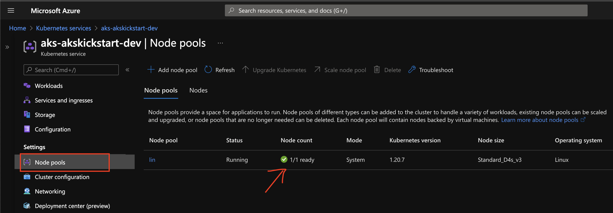

# Lab 4. Configuring your kubernetes applications 

### In this lab we will experiment with the different ways change the behavior of your application.

## 1. Configuring your application using environment variables.

In 2011 the developers at [Heroku](https://www.heroku.com/) presented a methodology for building software-as-a-service application [The Twelve-Factor App](https://12factor.net/) methodology. The 3rd of these twelve factors is to store config in the environment you can read more about this [here](https://12factor.net/config). Over the following exercises we will be looking at different ways to do this with kubernetes.


Let's start by creating a namespace for all the work we will be doing this lab, and setting it as the default namespace.

```powershell
kubectl create namespace lab4 
kubectl config set-context --current --namespace=lab4
```
Then let's create an application to display the current configuration.

```powershell
dotnet new razor -o Lab4
```

Open the `Index.cshtml.cs` file and replace the content with the following

```C#
using System;
using System.Collections;
using System.Collections.Generic;
using System.Linq;
using System.Threading.Tasks;
using Microsoft.AspNetCore.Mvc;
using Microsoft.AspNetCore.Mvc.RazorPages;
using Microsoft.Extensions.Configuration;
using Microsoft.Extensions.Logging;

namespace Lab4.Pages
{
    public class IndexModel : PageModel
    {
        private readonly ILogger<IndexModel> logger;
        private readonly IConfiguration config;

        public Dictionary<string, string> Values = new Dictionary<string, string>();

        public IndexModel(ILogger<IndexModel> logger, IConfiguration config)
        {
            this.logger = logger;
            this.config = config;
        }

        public void OnGet()
        {
            foreach (var value in config.AsEnumerable())
            {
                Values.Add(value.Key, value.Value);
            }
        }
    }
}
```
Open the `Index.cshtml` file and replace the content with the following.

```cshtml
@page
@model IndexModel
@{
    ViewData["Title"] = "Home page";
}

<div class="text-center">
    <h1 class="display-4">Configuration</h1>
</div>
<dl>
    @foreach (var item in Model.Values)
    {
          <dt>@item.Key</dt>
          <dd>@item.Value</dd>
    }
</dl>
```

Next let's add a `Dockerfile` with the following content.

```text
#See https://aka.ms/containerfastmode to understand how Visual Studio uses this Dockerfile to build your images for faster debugging.

FROM mcr.microsoft.com/dotnet/aspnet:5.0 AS base
WORKDIR /app
EXPOSE 80
EXPOSE 443

FROM mcr.microsoft.com/dotnet/sdk:5.0 AS build
WORKDIR /src
COPY ["Lab4/Lab4.csproj", "Lab4/"]
RUN dotnet restore "Lab4/Lab4.csproj"
COPY . .
WORKDIR "/src/Lab4"
RUN dotnet build "Lab4.csproj" -c Release -o /app/build

FROM build AS publish
RUN dotnet publish "Lab4.csproj" -c Release -o /app/publish

FROM base AS final
WORKDIR /app
COPY --from=publish /app/publish .
ENTRYPOINT ["dotnet", "Lab4.dll"]
```

Cool now let's build run and check the application.

```powershell
az acr build --registry $ACR_NAME --image configwebapp:v1 .
docker run --rm -it -p 8082:80 "$($ACR_NAME).azurecr.io/configwebapp:v1" 
```

We can now run our application in kubernetes let's prepare some files so we can create our resources using declarative object configuration. 

Create a folder named resources and add the following files.

deployment.yaml:

```text
apiVersion: apps/v1
kind: Deployment
metadata:
  labels:
    app: configapp
  name: configapp
spec:
  replicas: 1
  selector:
    matchLabels:
      app: configapp
  strategy: {}
  template:
    metadata:
      labels:
        app: configapp
    spec:
      containers:
      - image: <acrname>.azurecr.io/configwebapp:v1
        name: configwebapp

```

service.yaml

```text
apiVersion: v1
kind: Service
metadata:
  labels:
    app: configapp
  name: configapp
spec:
  ports:
  - port: 80
  selector:
    app: configapp
  type: LoadBalancer
```

We can now deploy and expose the application.

```powershell
kubectl apply -f resources/
kubectl get service configapp -w
```

One we have an assigned EXTERNAL-IP you should be able to visit the application and see any already configured values.

We can now start adding our own configuration values.

<!-- markdownlint-disable MD033 -->
<p>
<details>
  <summary>&#x2757; Note </summary>
<ul>  
  <p>We will be adding and changing various properties in our yaml files from now on. If you are curious about what properties you can configure and how you can use the <code>kubectl explain</code> command. This will give you a description of the entity and any fields it might have. You can navigate down to specific fields, or you can also ask for a recursive explanation. Below are a few commands you can try out.</p>

```powershell
kubectl explain pod
kubectl explain service --recursive
kubectl explain service.spec.selector
kubectl explain pod.spec.containers.env
kubectl explain pod.spec.containers.env --recursive
```
</ul>
</details>
</p>
<!-- markdownlint-enable MD033 -->

Let's edit the deployment.yaml file and add the following properties to containers field, and reapply the resources folder.

```text
env:
- name: test1
  value: value1
- name: test2
  value: value2 
```

```powershell
kubectl apply -f resources/
```

If you refresh the app you should now see your newly configured variables.

We can also use `ConfigMap`  resources to configure our applications. Take the time to read, understand and try some of the exercises [here](https://kubernetes.io/docs/tasks/configure-pod-container/configure-pod-configmap/). 

## 2. Configuring sensitive information using `Secrets`

Kubernetes also has `Secret` resources that allow you to store sensitive information. Kubernetes does treat secrets differently however secrets are stored as unencrypted base64-encoded strings and as such should not be considered secure.   

You can read more about Secrets [here](https://kubernetes.io/docs/concepts/configuration/secret/#details).

Let's create a `Secret` and expose it to our application. Run the follwing command to add a secrets.yaml file to the resources folder.

```powershell
kubectl create secret generic my-secret --from-literal=SqlConnectionString="Server=myServerAddress;Database=myDataBase;User Id=myUsername;Password=myPassword;" --from-literal=StorageConnectionString="DefaultEndpointsProtocol=http;AccountName=devstoreaccount1;AccountKey=Eby8vdM02xNOcqFlqUwJPLlmEtlCDXJ1OUzFT50uSRZ6IFsuFq2UVErCz4I6tq/K1SZFPTOtr/KBHBeksoGMGw==;"  --dry-run=client -oyaml > .\resources\secrets.yaml
```

Now let's add the secrets to our application by adding the following properties to containers field and reapplying the resources folder.

```yaml
envFrom:
- secretRef:
    name: my-secrets
```

```powershell
kubectl apply -f resources/
```

If you refresh the app you should now see your newly configured variables.

## 3. Beter secrets using managed pod identity to access key vault

There is a beter way to access sensitive data in our application and that is by using [AAD Pod Identity](https://github.com/Azure/aad-pod-identity). When we created our environment in [lab 1](..\lab1-environment-setup\LAB.md) we already set up AAD Pod Identity, over the next few steps we will configure our application to use it to securely access credentials in [Azure Key Vault](https://azure.microsoft.com/en-us/services/key-vault/).

Let's start off by creating a user assigned managed identity.

```powershell
az group create -l westeurope -n rg-lab4
az identity create -l westeurope -n id-lab4 -g rg-lab4
```

Assign `Managed Identity Operator` role to the cluster identity.

```powershell
$ID=az aks show -g rg-akskickstart-dev -n aks-akskickstart-dev --query identityProfile.kubeletidentity.clientId -o tsv
$SCOPE=az group show -g rg-lab4 --query id -otsv 
az role assignment create --role "Managed Identity Operator" --assignee $ID --scope $SCOPE
```

Create the key vault, add some secrets and ensure that our newly created managed identity can get and list secrets. 

```powershell
az keyvault create --name <kv-lab4-your-name> -g rg-lab4 -l westeurope
az keyvault secret set --name SqlConnectionString --vault-name <kv-lab4-your-name> --value "Server=myServerAddress;Database=myDataBase;User Id=myUsername;Password=myPassword;" 
$OBJECT_ID=az identity show  -n id-lab4 -g rg-lab4 --query "principalId" -otsv
az keyvault set-policy --name <kv-lab4-your-name> --object-id $OBJECT_ID --secret-permissions get list 
```

Configure our application to populate the configuration from key vault, and add the required nuget packages.

<!-- markdownlint-disable MD033 -->
<p>
<details>
  <summary>&#x2757; Note </summary>
<ul>  
  <p> We are using a custom <code>ChainedTokenCredential</code> so that it picks up the credentials from the azure cli instead of Visual Studio. You can read more about this <a href="https://docs.microsoft.com/en-us/dotnet/api/overview/azure/identity-readme#define-a-custom-authentication-flow-with-the-chainedtokencredential">here</a>.</p>
</ul>
</details>
</p>
<!-- markdownlint-enable MD033 -->

```C#
public static IHostBuilder CreateHostBuilder(string[] args) =>
    Host.CreateDefaultBuilder(args)
        .ConfigureAppConfiguration((context, config) =>
        {
            var builtConfig = config.Build();
            var credential = new ChainedTokenCredential(new ManagedIdentityCredential(), new AzureCliCredential());
            config.AddAzureKeyVault(new Uri(builtConfig["KeyVaultBaseUri"]), 
                credential);
        })
        .ConfigureWebHostDefaults(webBuilder =>
        {
            webBuilder.UseStartup<Startup>();
        });
```

```powershell
dotnet add package Azure.Extensions.AspNetCore.Configuration.Secrets  
dotnet add package Azure.Identity  
```

Before you run the application make sure to add the `KeyVaultBaseUri` to you appsettings.Development.json.

```json
{
  "KeyVaultBaseUri": "https://<kv-lab4-your-name>.vault.azure.net/",
  "DetailedErrors": true,
  "Logging": {
    "LogLevel": {
      "Default": "Information",
      "Microsoft": "Warning",
      "Microsoft.Hosting.Lifetime": "Information"
    }
  }
}
```

Let's rebuild the container with a new `v2` tag. We can test this locally but it would entail quite a bit of set up so we will skip that  this time.  

```powershell
az acr build --registry $ACR_NAME --image configwebapp:v2 .
```

We can now add the identity resources and configure application and reapply the resources.

First let's add the following file to the resources folder, replace the `<clientId>` and `<resourceID>` fields with the values from the following command:

```powershell
az identity show  -n id-lab4 -g rg-lab4 --query '{ clientId:clientId,   resourceID:id }' -ojsonc
```


identity.yaml

```text
apiVersion: "aadpodidentity.k8s.io/v1"
kind: AzureIdentity
metadata:
  name: id-lab4
  annotations:
    aadpodidentity.k8s.io/Behavior: namespaced    
spec:
  type: 0
  resourceID:<resourceID>
  clientID: <clientID>
---
apiVersion: "aadpodidentity.k8s.io/v1"
kind: AzureIdentityBinding
metadata:
  name: id-lab4-binding
spec:
  azureIdentity: id-lab4
  selector: id-lab4
```

Then let's configure an environment variable for the `KeyVaultBaseUri` property, and add the `aadpodidbinding` label in the deployment.yaml file.

```text
template:
  metadata:
    labels:
      app: configapp
      aadpodidbinding: id-lab4
  spec:
    containers:
    - image: <acrname>.azurecr.io/configwebapp:v1
      name: configwebapp
      env:
      - name: KeyVaultBaseUri
        value: https://<kv-lab4-your-name>.vault.azure.net/
```

Cool we can reapply the resources forder and watch the magic happen.

```powershell
kubectl apply -f resources/
```

It will take a bit longer for the resources to be provisioned this time, but one everything is up and running you should be able to see the secret you created earlier. You can now add a new secret to to the key vault, add restart the app by deleting the pod. You should then also be able to see the new secret.

```powershell
az keyvault secret set --name MyNewSecret --vault-name <kv-lab4-your-name> --value "MySecretValue"
kubectl delete po --all
```

We can also examine the resources to get insight into what exactly happened.

 ```powershell
 kubectl get AzureIdentity
 kubectl get AzureIdentityBinding
 kubectl get AzureAssignedIdentity
 kubectl get Events
 ```
 
You can find out more about AAD Pod Identity [here](https://azure.github.io/aad-pod-identity/docs/).

## 4. Preventing resource starvation with resource request and limits

One of the many benefits of containerized applications is that they can run side by side on a machine with less overhead, this does however mean that a container can potentially use up all the machine resources. To ensure that this does not happen it is a best practice to ensure that you application has resource request and limits  in place.  

<!-- markdownlint-disable MD033 -->
<p>
<details>
  <summary>&#x2757; Note </summary>
<ul>  

From the [docs](https://kubernetes.io/docs/concepts/configuration/manage-resources-containers/#resource-types):
> **Note:** If a Container specifies its own memory limit, but does not specify a memory request, Kubernetes automatically assigns a memory request that matches the limit. Similarly, if a Container specifies its own CPU limit, but does not specify a CPU request, Kubernetes automatically assigns a CPU request that matches the limitP

</ul>
</details>
</p>
<!-- markdownlint-enable MD033 -->


We can examine these properties using the `kubectl explain` command.

```powershell
 kubectl explain pod.spec.containers.resources.requests.cpu 
 kubectl explain pod.spec.containers.resources.limits.requests.memory 
```

Below is an example of a `Pod` with resource requests and limits.

example.yaml

```text
apiVersion: v1
kind: Pod
metadata:
  name: frontend
spec:
  containers:
  - name: app
    image: images.my-company.example/app:v4
    resources:
      requests:
        memory: "64Mi"
        cpu: "250m"
      limits:
        memory: "128Mi"
        cpu: "500m"
```

You can find out more about managing resources for containers [here](https://kubernetes.io/docs/concepts/configuration/manage-resources-containers/).

## 5. Configuring Liveness, Readiness, Startup probes and pod lifecycle.

### Propes

Kubernetes containers can be configured with the following propes.

- [Liveness](https://kubernetes.io/docs/concepts/workloads/pods/pod-lifecycle/#restart-policy), this is a probe that will run to determine if you container is still functioning, if the probe fails the pod will be terminated and restarted depending on the pod [`restartPolicy`](https://kubernetes.io/docs/concepts/workloads/pods/pod-lifecycle/#restart-policy).
- [Startup](https://kubernetes.io/docs/concepts/workloads/pods/pod-lifecycle/#when-should-you-use-a-startup-probe), this probe is good for containers that require a long startup periods. This probe can the be configured differently from the Liveness probe.
- [Readiness](https://kubernetes.io/docs/concepts/workloads/pods/pod-lifecycle/#when-should-you-use-a-readiness-probe), this probe is used to determine if the Pod is ready to receive traffic through Kubernetes Services.

You can read more about how to configure probes [here](https://kubernetes.io/docs/tasks/configure-pod-container/configure-liveness-readiness-startup-probes/)

### Pod Lifecycle

Apart from using these propes there are also other properties that let us hook into the Pod Lifecycle. Take some time to look through the documentation [here](https://kubernetes.io/docs/concepts/workloads/pods/pod-lifecycle/) on Pod Lifecycle.

## 6. Managing Pod Placement

In aks the cluster nodes correspond to the various nodes in the node pools. You can see these node pools and nodes in the portal. These node pools are backed by [Azure Virtual Machine Scale Sets](https://docs.microsoft.com/en-us/azure/virtual-machine-scale-sets/overview), and we can use the [cluster autoscaler](https://docs.microsoft.com/en-us/azure/aks/cluster-autoscaler) to automatically scale these pools up and down based on resource constraints.



These [node pools](https://docs.microsoft.com/en-us/azure/aks/use-multiple-node-pools) allow us to have different sets of virtual machines to host our application, the most obvious example being Windows vs Linux operation systems, but there is even the option to add [virtual nodes](https://docs.microsoft.com/en-us/azure/aks/virtual-nodes).

To ensure that a windows pod doesn't get scheduled on a linux node Kubernetes has the concept of Taints and Tolerations. In short this allows us to taint nodes so that Pods can only be scheduled on that node if they can tolerate the taint. You can read more about this [here](https://kubernetes.io/docs/concepts/scheduling-eviction/taint-and-toleration/).

Let's taint our node and inspect the result.

```powershell
$NODE_NAME=kubectl get nodes --output=jsonpath="{.items..metadata.name}"
kubectl taint nodes $NODE_NAME os=linux:NoSchedule
kubectl describe node $NODE_NAME
```

You should see that the taint has been applied to this node.

<!-- markdownlint-disable MD033 -->
<p>
<details>
  <summary>&#x261d; &#xfe0f; Hint </summary>
<ul>  
  <p>You can filter the output with the following command:</p>

```powershell
kubectl describe node $NODE_NAME | Select-String Taints
```

</ul>
</details>
</p>
<!-- markdownlint-enable MD033 -->

Next let's try and run a pod.

```powershell
kubectl run nginx
```

If we examine the Pod we will see that the Pod is not running because `0/1 nodes are available`.

```powershell
kubectl describe po nginx
```

Let's clean up by remove our taint.

```powershell
kubectl taint nodes $NODE_NAME os=linux:NoSchedule-
```

If you examine the pod again you will see that it is running.

```powershell
kubectl describe po nginx
```

Doing this does not prevent the Pod from running on an inappropriate node, this can be done by applying a label to the node and defining a [nodeSelector](https://kubernetes.io/docs/concepts/scheduling-eviction/assign-pod-node/#nodeselector) on the Pod.

Below are also links to documentation on other ways we can manage Pod Placement:

- [Node affinity](https://kubernetes.io/docs/concepts/scheduling-eviction/assign-pod-node/#node-affinity)
- [Inter-pod affinity and anti-affinity ](https://kubernetes.io/docs/concepts/scheduling-eviction/assign-pod-node/#inter-pod-affinity-and-anti-affinity)
- [nodeName](https://kubernetes.io/docs/concepts/scheduling-eviction/assign-pod-node/#nodename)

## 7. Configuring apiserver access with Service Accounts and RBAC

In lab 2 we discovered various ways of accessing the cluster, locally this is possible because of our Kubernetes config file. We can also examine the Kubernetes resources from a Pod running in the cluster. By default all Pods have a service account attached to them. Let's have a look.

```powershell
kubectl get po nginx -oyaml | Select-String serviceAccount
kubectl describe sa default
$SECRET_NAME = kubectl get sa default -o jsonpath="{.secrets..name}"
kubectl describe secret $SECRET_NAME
```

If we examine the output from these commands we can see that the nginx Pod has an Service Account 'default' and that that account has a secret that contains the properties: `namespace`  `ca.cert` and `token`. We can also copy the token and navigate to [https://jwt.io/](https://jwt.io/)  and examine it futher.

```json
{
  "iss": "kubernetes/serviceaccount",
  "kubernetes.io/serviceaccount/namespace": "lab4",
  "kubernetes.io/serviceaccount/secret.name": "default-token-pvzfg",
  "kubernetes.io/serviceaccount/service-account.name": "default",
  "kubernetes.io/serviceaccount/service-account.uid": "465e698d-7f67-46db-a947-a63add7c7b7e",
  "sub": "system:serviceaccount:lab4:default"
}
```

Cool so we have a token let's query the api-server from a Pod. The follwing command will start the pod in interactive mode run the command `kubectl version` and the exit and delete the Pod.

```powershell
kubectl run kubectl --image bitnami/kubectl -i --rm --restart=Never -- version
```

Now let's try and querying Pods.

```powershell
kubectl run kubectl --image bitnami/kubectl -i --rm --restart=Never -- get po
```

Output:

```text
Error from server (Forbidden): pods is forbidden: User "system:serviceaccount:lab4:default" cannot list resource "pods" in API group "" in the namespace "lab4"
```

It appears that we don't have the right to list pods, this is because by default service accounts do not have permissions. We can give service account permission by using `Role` or `ClusterRole` resources to define the permissions and then use `RoleBinding` or `ClusterRoleBinding` resources assign permissions to the service account.

Run the following commands to inspect the already existing `ClusterRoles`.

```powershell
kubectl get clusterroles
kubectl describe clusterroles aad-pod-identity-mic
kubectl describe clusterroles view
kubectl describe clusterroles edit
```

We can also examine the existing `ClusterRoleBindings`

```powershell
kubectl get clusterrolebindings
kubectl describe clusterrolebindings aad-pod-identity-mic
```

Let's create a `RoleBinding` for our default service account for the view `ClusterRole`, and rerun the previous command.

```powershell
kubectl create rolebinding lab4-rolebinding --serviceaccount lab4:default --clusterrole view
kubectl run kubectl --image bitnami/kubectl -i --rm --restart=Never -- get po
```

Cool we now have permission to view the pods, let's try and get all the pods from all the namespaces.

```powershell
kubectl run kubectl --image bitnami/kubectl -i --rm --restart=Never -- get po --all-namespaces
```

Output:
```text
Error from server (Forbidden): pods is forbidden: User "system:serviceaccount:lab4:default" cannot list resource "pods" in API group "" at the cluster scope
```

Luckily we can fix this by creating a `ClusterRoleBinding` instead of a `RoleBinding`

```powershell
kubectl delete rolebinding lab4-rolebinding
kubectl create clusterrolebinding lab4-rolebinding --serviceaccount lab4:default --clusterrole view
kubectl run kubectl --image bitnami/kubectl -i --rm --restart=Never -- get po --all-namespaces
```

You can read more about RBAC in Kubernetes [here](https://kubernetes.io/docs/reference/access-authn-authz/rbac/).

## 8. Cleanup

Awesome Lab 4 is done let's clean up our resources.

```powershell
kubectl delete ns lab4
kubectl delete clusterrolebinding lab4-rolebinding
```

[:arrow_backward: previous](../lab3-workloads/LAB.md)  [next :arrow_forward:](../lab5-networking/LAB.md)