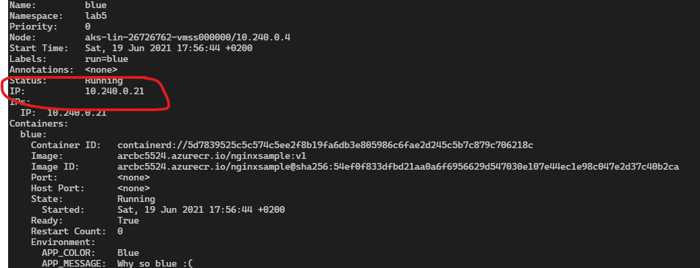
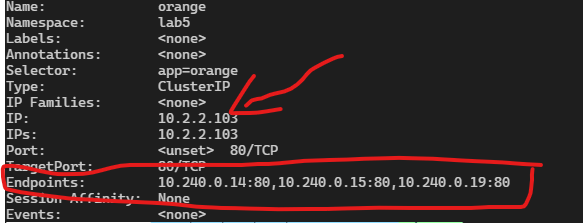
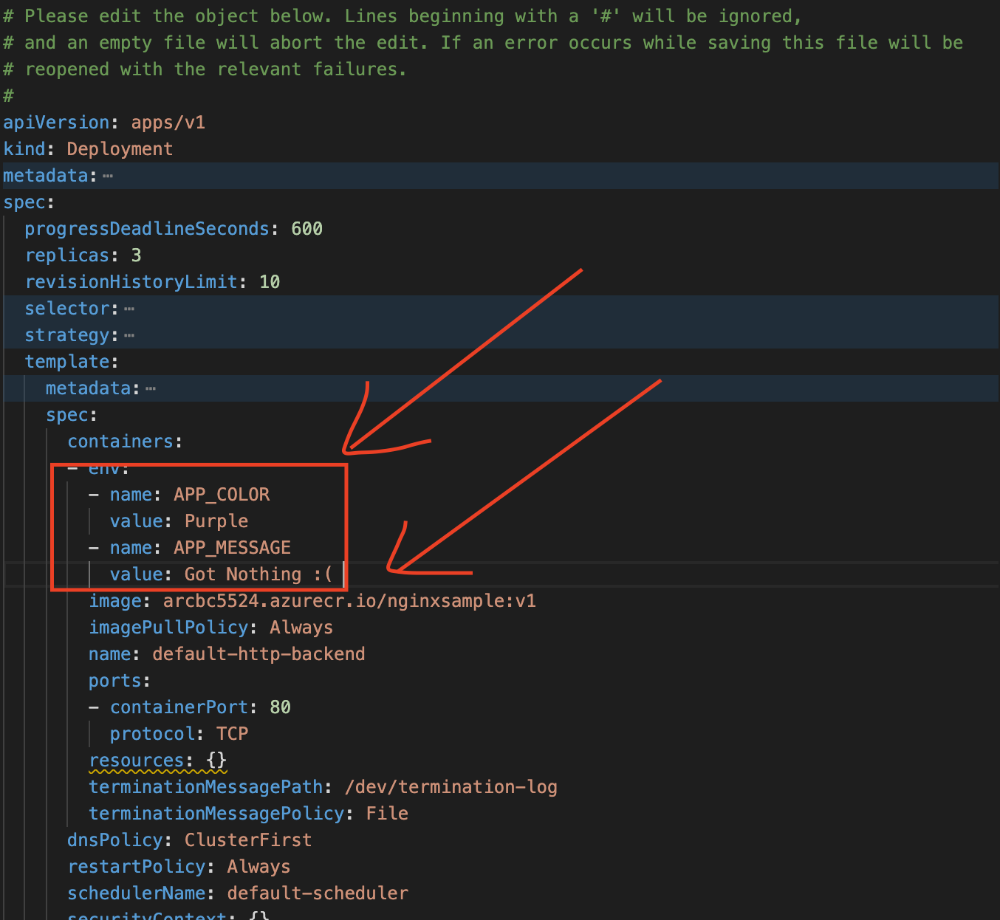
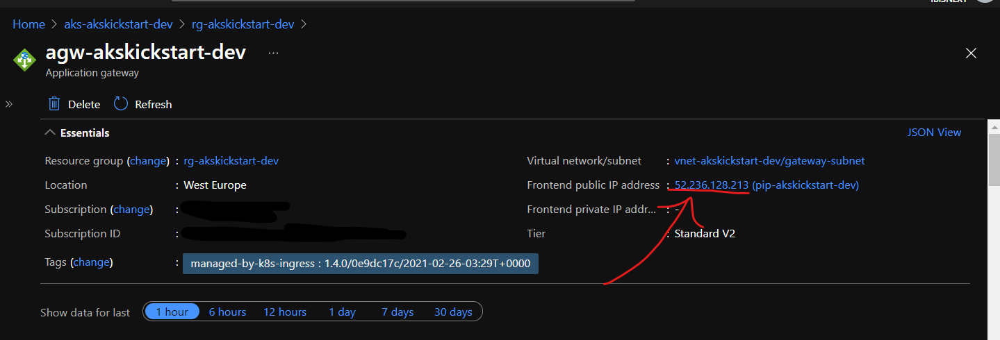
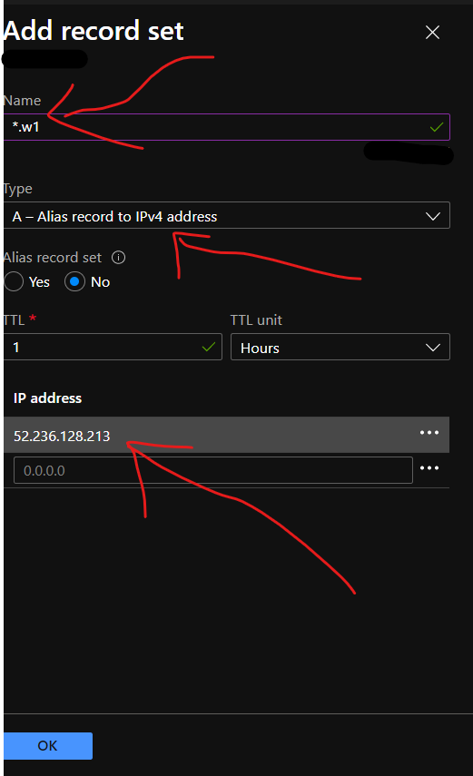
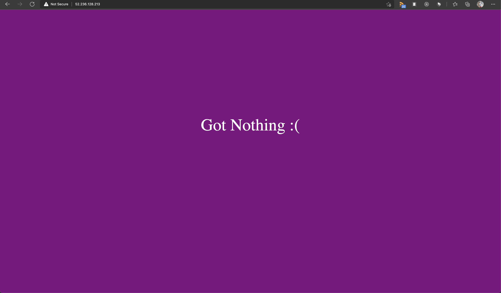

# Lab 5. Exposing your application with kubernetes networking

## 1. Exposing workloads using Services

Let's start of by creating another application for this lab.

First, create an index.html file in a lab5 folder with the following content.

index.html

```html
<!DOCTYPE html>
<html>
  <head>
    <style>
      html {
        height: 100%;
      }
      .flex-container {
        display: flex;
        height: 80%;
        justify-content: center;
        align-items: center;
        background-color: APP_COLOR;
      }

      .flex-container > div {
        width: 100%;
        margin: 10px;
        text-align: center;
        line-height: 150px;
        font-size: 60px;
        color: white;
      }
    </style>
  </head>
  <body class="flex-container">
    <div>APP_MESSAGE</div>
  </body>
</html>
```

Next, let's add a script file entrypoint.sh that will overwrite `APP_COLOR` and `APP_MESSAGE` in the index.html file values with environment variables.

entrypoint.sh

```sh
#!/bin/sh
if [ "$APP_COLOR" == "Blue" ];
then
    sed -i "s/APP_COLOR/$APP_COLOR/g" /usr/share/nginx/html/index.html
elif [ "$APP_COLOR" == "Red" ];
then
    sed -i "s/APP_COLOR/$APP_COLOR/g" /usr/share/nginx/html/index.html
elif [ "$APP_COLOR" == "Purple" ];
then
    sed -i "s/APP_COLOR/$APP_COLOR/g" /usr/share/nginx/html/index.html
elif [ "$APP_COLOR" == "Orange" ];
then
    sed -i "s/APP_COLOR/$APP_COLOR/g" /usr/share/nginx/html/index.html
else
    sed -i "s/APP_COLOR/Green/g" /usr/share/nginx/html/index.html
fi

if test -z "$APP_MESSAGE"; then
      sed -i "s/APP_MESSAGE/Hello There!/g" /usr/share/nginx/html/index.html
else
    sed -i "s/APP_MESSAGE/$APP_MESSAGE/g" /usr/share/nginx/html/index.html
fi
```

Next, let's add a nginx configuration file default.conf.

default.conf

```text
server {

  listen 80;

  sendfile on;

  default_type application/octet-stream;

  gzip on;
  gzip_http_version 1.1;
  gzip_disable      "MSIE [1-6]\.";
  gzip_min_length   256;
  gzip_vary         on;
  gzip_proxied      expired no-cache no-store private auth;
  gzip_types        text/plain text/css application/json application/javascript application/x-javascript text/xml application/xml application/xml+rss text/javascript;
  gzip_comp_level   9;

  location / {
    alias /usr/share/nginx/html/;
    try_files $uri $uri/ /index.html =404;
    expires -1;
  }
}
```

And finally let's add a Dockerfile.

Dockerfile

```text
FROM nginx:stable-alpine
COPY default.conf /etc/nginx/conf.d/
COPY index.html /usr/share/nginx/html
COPY entrypoint.sh /docker-entrypoint.d
RUN chmod +x /docker-entrypoint.d/entrypoint.sh
```

We can now build and test our application by running the following commands. Make sure to stop the previous command before running the next one.

```powershell
az acr build -t nginxsample:v1 -r $ACR_NAME . 
docker run --rm -it -p 8082:80 "$($ACR_NAME).azurecr.io/nginxsample:v1" 
docker run --rm -it -p 8082:80  -e APP_COLOR=Blue -e APP_MESSAGE='Great Times!'  "$($ACR_NAME).azurecr.io/nginxsample:v1" 
docker run --rm -it -p 8082:80  -e APP_COLOR=Red -e APP_MESSAGE="Hey Ho Let's Go!"   "$($ACR_NAME).azurecr.io/nginxsample:v1"
```

You can view the website by navigating to [http://localhost:8082/](http://localhost:8082/).

Cool, now that we know that our container is working let's deploy a few resources to our cluster.

Let's start by creating a namespace for all the work we will be doing this lab, and setting it as the default namespace.

```powershell
kubectl create ns lab5
kubectl config set-context --current --namespace=lab5
```

Next, let's run a few versions of our application.

```powershell
kubectl run green --image "$($ACR_NAME).azurecr.io/nginxsample:v1"   
kubectl run red --image "$($ACR_NAME).azurecr.io/nginxsample:v1" --env="APP_COLOR=Red" --env="APP_MESSAGE=Hey Ho Let's Go!"
kubectl run blue --image "$($ACR_NAME).azurecr.io/nginxsample:v1" --env="APP_COLOR=Blue" --env="APP_MESSAGE=Why so blue :("
```

Run the following command to inspect our blue Pod.

```powershell
kubectl describe  po blue
```

You should be able to find an IP address, this is the Pods IP address currently within the cluster virtual network. You can access the blue application on this IP address. Let's try this out by using busybox, and using curl to issue a get request on the IP address from within the cluster.



```powershell
kubectl run busybox --image busybox -i --rm --restart=Never -- wget -qO- <BLUE_POD_IP>
```

This is great, we can access the Pod with it's IP addres, but  Pods are ephemeral, and therefore the attached IP address is lost once the Pod has restarted. This is where `Services` come in, they give us a stable way to access the underlying Pods. You can read more about the motivation behind Services [here](https://kubernetes.io/docs/concepts/services-networking/service/#motivation)

Let's add some more resources to our namespace by creating a deployment and a service to expose the deployment.

deployment.yaml

```yaml
apiVersion: apps/v1
kind: Deployment
metadata:
  labels:
    app: orange
  name: orange
spec:
  replicas: 3
  selector:
    matchLabels:
      app: orange
  strategy: {}
  template:
    metadata:
      labels:
        app: orange
    spec:
      containers:
      - image: <your-acr-name>.azurecr.io/nginxsample:v1
        name: nginxsample
        env:
        - name: APP_COLOR
          value: Orange
        - name: APP_MESSAGE
          value: Hup Holland Hup!    
---
apiVersion: v1
kind: Service
metadata:
  name: orange
spec:
  selector:
    app: orange
  ports:
    - protocol: TCP
      port: 80
```

```powershell
kubectl apply -f ./deployment.yaml
```

Let's first explore the Pods we have running and their IP addresses.

```powershell
kubectl describe po | Select-String ^Name:,^Status:,^IP: 
```

Cool now let's have a look at our orange service (don't forget to apply the resource first).

```powershell
kubectl describe service orange 
```

The service has it's own "stable" IP address but also has an endpoints property with the IP addresses of the "orange" pods.



Apart from that, Azure Kubernetes Services also has a dns server running which allows us to access the Pods using the servicename with the namespace name, or just the servicename if you are in the same namespace.

Kubernetes also ensures that you have environment variables available that can let you know where to access a particular service.

Let's run busybox in interactive mode and inspect a few more items in the cluster.

```powershell
kubectl run busybox --image busybox -i --tty --rm --restart=Never -- sh
```

Once we have entered the busybox shell in interactive mode we can inspect the environment variables and also do a name server lookup for our service.

```sh
printenv
nslookup orange
wget -qO- orange
```

Cool, so from within the cluster if we use a Service we can use the service name to communicate with the backend applications.

Earlier in this workshop we already created services to expose our workloads. We did this by creating a Service of type LoadBalancer.  

From the [docs](https://kubernetes.io/docs/concepts/services-networking/service/#publishing-services-service-types)
> LoadBalancer: Exposes the Service externally using a cloud provider's load balancer. NodePort and ClusterIP Services, to which the external load balancer routes, are automatically created.

Let's finish this section on Services by creating a Service that will target our green, blue and red Pods.

We will start by adding a label to our Pods.

```powershell
kubectl label po blue app=rainbow 
kubectl label po red app=rainbow 
kubectl label po green app=rainbow 
```

Now let's create the rainbow Service, by using the selector `app: rainbow` the Service will target all Pods with that label.

service.yaml

```yaml
apiVersion: v1
kind: Service
metadata:
  name: rainbow
spec:
  type: LoadBalancer
  selector:
    app: rainbow
  ports:
    - protocol: TCP
      port: 80
```

```powershell
kubectl apply -f service.yaml
kubectl get service rainbow -w
```

Once you have an IP address you can run the following commands several times to see the responses changing from Blue to Green to Red.

```powershell
curl -s http://<rainbow-ip> | Select-String background-color:
```

You can read more about Services [here](https://kubernetes.io/docs/concepts/services-networking/service/)

## 2. Exposing workloads with Application Gateway using Ingresses

In [Lab 1](../lab1-environment-setup/LAB.md), when we set up our environment we also created an [Application Gateway](https://docs.microsoft.com/en-us/azure/application-gateway/overview), and we added [Ingress Controller](https://kubernetes.io/docs/concepts/services-networking/ingress-controllers/) resources to our cluster so we can configure application gateway listeners and routing rules to expose our workloads. We also added a default rule that captures all incoming traffic and directs it to the `default-http-backend` Pods.

```powershell
kubectl describe deployment -n default 
kubectl get po --selector app=default-http-backend -n default  
```

Let's change the default backend image to our new created image.

```powershell
env:KUBE_EDITOR='code --wait'
kubectl edit deployment default-http-backend -n default
```

This should open up the Deployment resource in Visual Studio Code. Edit the image and add environment variables for `APP_COLOR` and `APP_MESSAGE`, save and close the file to update the Deployment resource.



For the next exercises we will need a wildcard ssl certficate, and we will need to configure a wildcard DNS Record for the same domain to point to the IP address of your application gateway. Below are instruction on how to do this with Azure DNS.

First, find the IP address of your Application Gateway.



Next. in Azure DNS, set up an A Record to point to the Application Gateway IP address.



You can set up the SSL certificate by following the instructions [here](https://github.com/Ibis-Software/AksKickStarters#add-ssl-certificates-from-keyvault). Make sure to make a note of your `<ssl-certificate-name>` for later.

If everything is set up ok you should be able to navigate to any subdomain of you domain and end up on the default app we just configured.



Ok, let's now try and expose our green Pod on it's own subdomain. First we will need to expose the green  Pod.

```powershell
kubectl expose po/green --port 80
```

Now let's create an `Ingress` resource to expose our green Pod to the internet. 

ingress.yaml

```yaml
apiVersion: networking.k8s.io/v1
kind: Ingress
metadata:
  name: green
  annotations:
    kubernetes.io/ingress.class: azure/application-gateway  
spec:
  rules:
  - host: <green.your-domain>
    http:
      paths:
      - pathType: ImplementationSpecific
        path: "/"
        backend:
          service:
            name: green
            port:
              number: 80                    
```

```powershell
kubectl apply -f ingress.yaml
```

If we wait about a minute and then try to navigate to our host you should see the green website.

We can now also edit the `ingress.yaml` file to enable ssl redirect and offloading by adding the following annotations.

```yaml
appgw.ingress.kubernetes.io/ssl-redirect: "true"
appgw.ingress.kubernetes.io/appgw-ssl-certificate: <your-ssl-certificate-name>
```

If you then reapply the file you should then only be able to access your site over ssl.

Follow the steps above to also expose you `blue` and `red` Pods.

Cool, let's do one more this time. We will create an `Ingress` resource to expose all our Pods on different paths.

rainbow.ingress.yaml

```yaml
apiVersion: networking.k8s.io/v1
kind: Ingress
metadata:
  name: rainbow
  annotations:
    kubernetes.io/ingress.class: azure/application-gateway 
    appgw.ingress.kubernetes.io/ssl-redirect: "true"
    appgw.ingress.kubernetes.io/appgw-ssl-certificate: <your-ssl-certificate-name>   
spec:
  rules:
  - host: <rainbow.your-domain>
    http:
      paths:
      - path: "/"
        pathType: ImplementationSpecific
        backend:
          service:
            name: green
            port:
              number: 80
      - path: "/blue*"
        pathType: ImplementationSpecific
        backend:
          service:
            name: blue
            port:
              number: 80
      - path: "/red*"
        pathType: ImplementationSpecific
        backend:
          service:
            name: red
            port:
              number: 80              
      - path: "/orange*"
        pathType: ImplementationSpecific
        backend:
          service:
            name: orange
            port:
              number: 80                
```

Once you have deployed this file you should have the following configuration.

```text
<rainbow.your-domain> => green
<rainbow.your-domain>/orange => orange
<rainbow.your-domain>/orange/blue => orange
<rainbow.your-domain>/blue => blue
<rainbow.your-domain>/red => red
```

Navigate to your website and test out the various paths.

<!-- markdownlint-disable MD033 -->
<details>
  <summary style="font-size:24px; font-weight:bold;">&#127873; Bonus</summary>

<ul>
Before we clean up let's inspect the application gateway, looking at how the orange Pods are configured. Asuming you only have one Application Gateway we can use the following queries to get the gateway and resource group name.

```powershell
$GATEWAY_NAME= az network application-gateway list --query "[0].name" -otsv
$GROUP_NAME= az network application-gateway list --query "[0].resourceGroup" -otsv
```

Next run the following commands to inspect the Application Gateway configuration.  

```powershell
az network application-gateway http-listener list -g $GROUP_NAME --gateway-name $GATEWAY_NAME  --query "[].{name:name,host:hostNames[0] }" -otable
az network application-gateway rules list -g $GROUP_NAME --gateway-name $GATEWAY_NAME -ojsonc
z network application-gateway url-path-map list -g $GROUP_NAME --gateway-name $GATEWAY_NAME --query "[0]" -ojson | Select-String "pool-lab5-orange-80-bp-80" -Context 2,19
az network application-gateway address-pool show -n pool-lab5-orange-80-bp-80 -g $GROUP_NAME --gateway-name $GATEWAY_NAME --query "backendAddresses[].ipAddress"  -ojsonc
kubectl describe svc orange | Select-String Endpoints:
```

If you inspect the output from the queries above you should get a pretty good idea of how Application Gateway maps the listeners to Pods.

</ul>
</details>
<!-- markdownlint-enable MD033 -->

You can read more about Kubernetes Ingress [here](https://kubernetes.io/docs/concepts/services-networking/ingress/), and you can read more about the Application Gateway Ingress Controller [here](https://azure.github.io/application-gateway-kubernetes-ingress/).

Let's clean up and move on to the next Lab.

```powershell
kubectl delete ns lab5
kubectl config set-context --current --namespace=default
```

[:arrow_backward: previous](../lab4-configuration/LAB.md) [next :arrow_forward:](../lab6-volumes/LAB.md)
