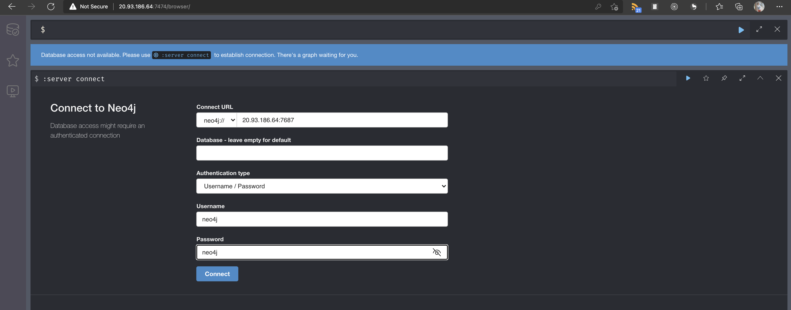
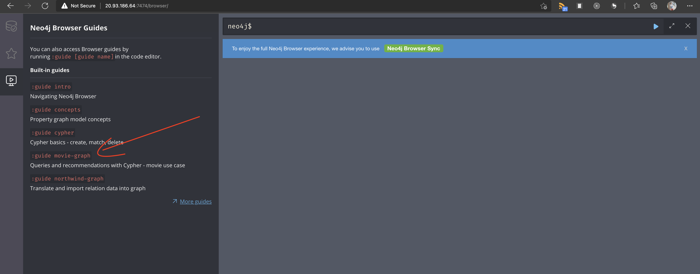
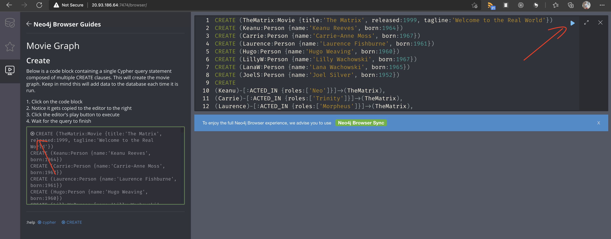
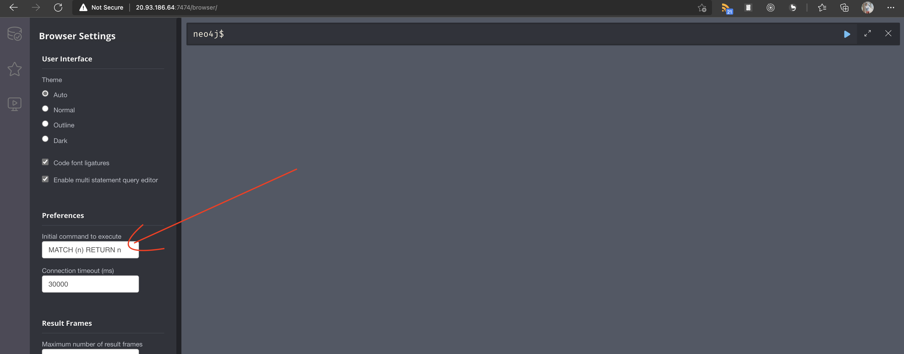
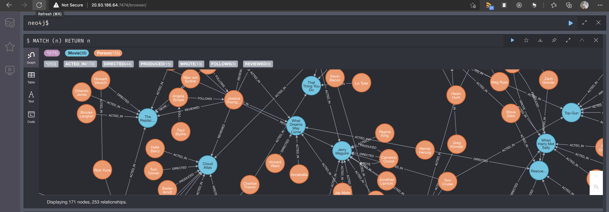

# Lab 6 Storing and preserving application data with volumes

Let's start by creating a namespace and setting it as default for this lab.

```powershell
kubectl create ns lab6
kubectl config set-context --current --namespace=lab6
```

Pods are ephemeral and so any data that is stored in the Pod gets lost once the Pod is deleted, or crashes. Let's demonstrate this.

First create a Pod based on the `neo4j` image and expose it.

```powershell
kubectl run neo4j --image neo4j 
kubectl expose pod neo4j --port=7474,7687 --type=LoadBalancer
kubectl get svc neo4j -w
```

Once we have an IP address we can navigate to it on port `7474` and enter the default neo4j username and password.



Once you are logged in and have changed your password, navigate to Neo4j Browser Guides and select `:guide movie-graph`.



Follow the instructions to populate the data.



Once you have populated the demo data, navigate to settings and change the initial command to execute to `MATCH (n) RETURN n`.



Refresh the browser to see all the entities that are now stored in neo4j.



Delete and recreate the Pod.

```powershell
kubectl delete po/neo4j
kubectl run neo4j --image neo4j 
```

If you now refresh the browser you will be confronted with the login screen. Normally our applications are stateless and this doesn't matter but there might be a situation where you want to be able to persist data over Pod restarts and crashes. Kubernetes has various resources to help with this.

Azure Kubernetes Services comes preconfigured with a set of `StorageClasses`.

```powershell
kubectl get storageclasses  
kubectl describe storageclasses default
kubectl describe storageclasses managed-premium
```

If you inspect the output from the commands above you will see that the default StorageClass uses  `storageaccounttype=StandardSSD_LRS` whereas the managed-premium uses `storageaccounttype=Premium_LRS`. You can find our more about these Storage classes [here](https://docs.microsoft.com/en-us/azure/aks/concepts-storage#storage-classes).

Let's use the managed-premium storage class to create a PersistenVolumeClaim. With this claim we are asking Azure to provision an Azure Premium Managed Disk. This disk will be created when the first Pod requests it. We can then use this PersistentVolumeClaim in our Pod.

pvc.yaml

```yaml
apiVersion: v1
kind: PersistentVolumeClaim
metadata:
  name: neo4j-disk
spec:
  accessModes:
  - ReadWriteOnce
  storageClassName: managed-premium
  resources:
    requests:
      storage: 5Gi
```

pod.yaml

```yaml
kind: Pod
apiVersion: v1
metadata:
  name: neo4j
  labels:
    run: neo4j
spec:
  containers:
    - name: neo4j
      image: neo4j
      volumeMounts:
      - mountPath: "/data"
        name: volume
  volumes:
    - name: volume
      persistentVolumeClaim:
        claimName: neo4j-disk
```

```powershell
kubectl delete po/neo4j
kubectl apply -f pvc.yaml -f pod.yaml
```

If you now retry the steps above, and delete and reapply the `pod.yaml` file you initial data will still be available. We can also inspect the `PersistentVolume` that was created as a result of our actions, and be able to locate the Azure Disk resource where our data is stored.

```powershell
kubectl describe pv
```

You can also use [ConfigMaps](https://kubernetes.io/docs/tasks/configure-pod-container/configure-pod-configmap/#add-configmap-data-to-a-volume) and [Secrets](https://kubernetes.io/docs/concepts/configuration/secret/#using-secrets-as-files-from-a-pod) as volumes. You can find out more about the Storage options in Azure Kubernetes Services [here](https://docs.microsoft.com/en-us/azure/aks/concepts-storage).

Let's clean up our resources and move on to Lab 7.

```powershell
kubectl delete ns lab6
kubectl config set-context --current --namespace=default
```

[:arrow_backward: previous](../lab5-networking/LAB.md)  [next :arrow_forward:](../lab7-deploy/LAB.md)
