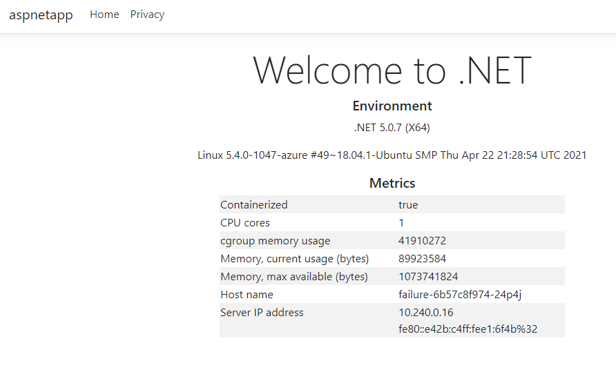

# Lab 8. Troubleshooting Deployments

Examine the Helm Chart located at. Deploy the chart to the cluster using any method you like and watch it fail. 

If you have troubles deploying the chart use the hint below.

<!-- markdownlint-disable MD033 -->
<p>
<details>
  <summary>&#x261d; &#xfe0f; Helm command </summary>
  <p>One way to deploy the chart is using the helm command like this:</p>

```
helm upgrade failure .\helm\ --install --namespace lab8 --wait --atomic --create-namespace --values .\helm\values.yaml
```
</details>
</p>
<!-- markdownlint-enable MD033 -->

Your job for this lab is to identitify the problems, solve them and get the deployment up and running. When all issues are resolved the result should look like this:



<!-- markdownlint-disable MD033 -->
<p>
<details>
  <summary>&#x261d; &#xfe0f; Resources </summary>
  <p><a href="https://kubernetes.io/docs/tasks/debug-application-cluster/debug-application/#debugging-pods">Troubleshoot Applications</a></p>
</details>
</p>
<!-- markdownlint-enable MD033 -->

<!-- markdownlint-disable MD033 -->
<details>
  <summary>&#127873; Bonus</summary>

- How many problems did you solve?
- What are the symptoms of the problems?
- How did you solve them?

</details>
<!-- markdownlint-enable MD033 -->

[:arrow_backward: previous](../lab7-deploy/LAB.md)