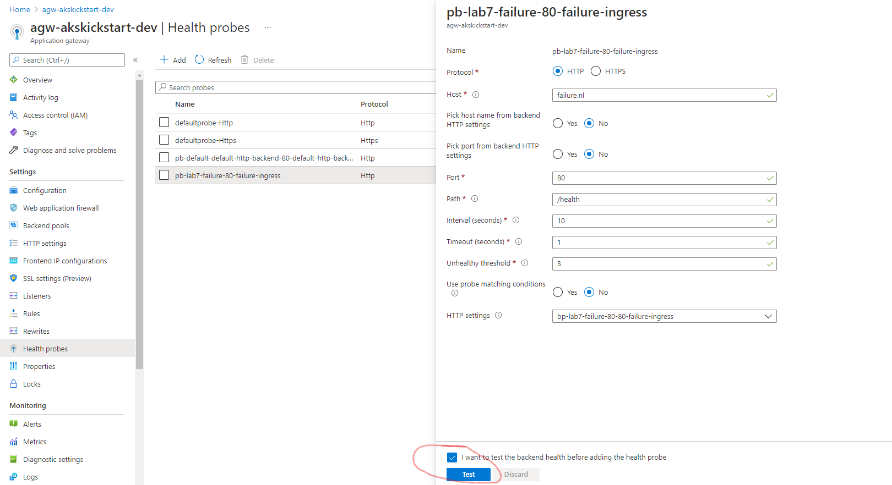
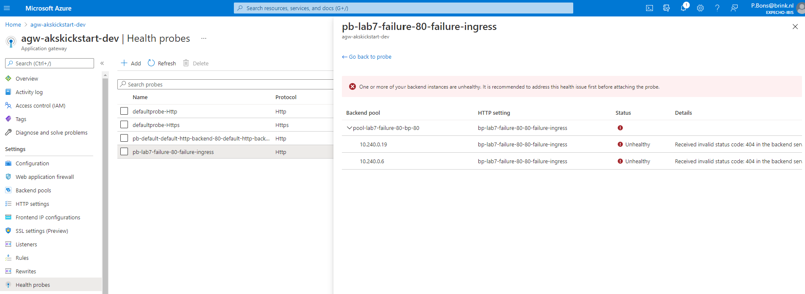

# Lab 8. Troubleshooting Deployments - Solution

## The pods couldn't be scheduled - No windows nodes available
The pods could not be scheduled because there are no windows nodes availabe. This requirement was added by applying a node selector in the values file:

```
nodeSelector:
  kubernetes.io/os: windows
```

The error is: `0/1 nodes are available: 1 node(s) didn't match Pod's node affinity.`. 

### Solution

Remove the node selector or set it to `windows`

### Remarks

You can run easily into issues when you have mixed workloads, some windows based, some linux based. See https://kubernetes.io/docs/setup/production-environment/windows/user-guide-windows-containers/ for details about node selectors.

## The pods couldn't be scheduled - Insufficient memory
The pods could not be scheduled because there are no nodes availabe that can satify the resource limits. This requirement was added by asking more memory than is available in the values file:

```
resources:
  limits:
    cpu: 1000m
    memory: 65536Mi
  requests:
    cpu: 200m
    memory: 65536Mi
```

The error is: `0/1 nodes are available: 1 Insufficient memory.`. 

### Solution

Lower the minimal memory required

### Remarks

When your cluster does not scale or you make mistakes in the calculation of the needed amount of resources this situation can happen. More about limits can be found here: https://kubernetes.io/docs/concepts/configuration/manage-resources-containers/

## The pods are stuck in Waiting state
The pods could not be started because there where problems with getting the container image. In this case the image was not specified correctly in the values file:

```
repository: mcr.mircosoft.com/dotnet/samples
```

The waiting reason is: `ImagePullBackOff` or `ImageErr`. 

### Solution

Fix the type in the repository definition: repository: mcr.mi**cr**osoft.com/dotnet/samples

### Remarks

ImagePullBackOff or ImageErr errors can happen if there are problems accessing the container image registry. This include access and permission issues and wrong names or labels.

## The pods won't start
The pods could not be started because there where problems with the workload. The restart counter of the pod is increasing as well.

The waiting reason is: `CrashLoopBackOff` or `ContainersNotReady` with the message `containers with unready status: [failure]`. 

### Solution

In the deployment file the livenessProbe and readinessProbe point to a /health endpoint that does not exist. Set the path to `/`.

### Remarks

Typically you can see a high restart count when the workload of the application is not working as expected. This could be due to startup problems of the application or misconfigured probes.

Don't forget to view the (live) logs of the pod, they might show valueable information that can help fix the problem.

You can check the probes using the Azure Application Gateway as well using these steps:

- Browse to the gateway and from the menu choose `Health Probes`

- Tick the box and press the `Test` button
